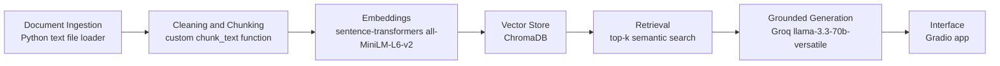

# Planning: The Unofficial Guide

## Domain

My domain is **The Unofficial Guide to CS Professors and CS Courses at Caldwell University**.

This project focuses on student-centered knowledge about Computer Science professors, Computer Science courses, difficulty, workload, grading style, feedback, lecture style, and official CS pathways at Caldwell University. This knowledge is valuable because official university pages explain programs, requirements, and course descriptions, but they do not always explain what students actually experience in classes. Students often want to know which professors give helpful feedback, which courses seem difficult, what teaching styles to expect, and what courses are part of the CS pathway. That information is spread across student review pages and official pages, so this project makes it searchable through a RAG system.

## Documents

I will use 10 source documents stored as `.txt` files inside `data/raw/`.

1. `rmp_arnold_toffler.txt` — Rate My Professors page/review notes for Arnold Toffler at Caldwell University.
2. `rmp_vladislav_veksler.txt` — Rate My Professors page/review notes for Vladislav Veksler at Caldwell University.
3. `rmp_isaac_damoah.txt` — Rate My Professors page/review notes for Isaac Damoah at Caldwell University.
4. `rmp_adriana_wise.txt` — Rate My Professors page/review notes for Adriana Wise at Caldwell University.
5. `rmp_lowell_qually.txt` — Rate My Professors page/review notes for Lowell Qually at Caldwell University.
6. `rmp_caldwell_cs_department.txt` — Rate My Professors Computer Science department page for Caldwell University.
7. `caldwell_cs_program.txt` — Caldwell University Computer Science program page.
8. `caldwell_cs_department.txt` — Caldwell University Computer Science and Information Systems department page.
9. `caldwell_cs_faculty.txt` — Caldwell University faculty/staff page for the School of Business and Computer Science.
10. `caldwell_cs_four_year_plan.txt` — Caldwell University Computer Science suggested four-year major plan/course planning document.

These documents provide a mix of unofficial student-centered professor review information and official Caldwell CS program/course context.

## Architecture

## Chunking Strategy

I will split the documents into chunks of about **700 characters** with **100 characters of overlap**.

This strategy fits my document type because many of the documents are short professor review summaries, student-centered notes, and official course descriptions. A 700-character chunk is large enough to keep a complete idea together, such as a professor’s feedback style, difficulty, or course description. It is also small enough to avoid mixing too many unrelated facts into one chunk.

The 100-character overlap helps protect important information near chunk boundaries. For example, one sentence may mention that a professor gives feedback, while the next sentence explains whether that feedback is useful. Overlap increases the chance that both pieces of information appear together in at least one retrievable chunk.

If chunks are too small, they may become fragments that do not make sense on their own. If chunks are too large, one chunk may contain too many unrelated details about professors, courses, and department information, making retrieval less precise.

## Retrieval Approach

I will use the `all-MiniLM-L6-v2` embedding model from the `sentence-transformers` library.

I chose this model because it runs locally, is free, does not require API credits, and is fast enough for a small class project. I will store embeddings in ChromaDB. For each user query, the system will retrieve the top 4 most relevant chunks.

I chose **top-k = 4** because retrieving too few chunks may miss important evidence, while retrieving too many chunks may include loosely related information and make the generated answer less focused.

If this system were deployed in production, I would consider tradeoffs such as embedding accuracy, cost, latency, context length, multilingual support, privacy, and whether the model should run locally or through an API. A larger API-based embedding model might perform better on informal student review language, but a local model is cheaper and easier to run for this project.

## Evaluation Plan

I will evaluate the system using 5 specific test questions. Each question has an expected answer that can be checked against the collected documents.

### Test Question 1

Question: Which professor gives good feedback?

Expected correct answer: The system should mention professors whose documents say they give good feedback, such as Vladislav Veksler, Arnold Toffler, or Isaac Damoah.

### Test Question 2

Question: Which professor seems difficult?

Expected correct answer: The system should mention Adriana Wise or Arnold Toffler because those documents mention difficult exams, test-heavy classes, unclear homework due dates, or lecture-heavy style.

### Test Question 3

Question: What CS courses does Caldwell offer?

Expected correct answer: The system should list official CS courses such as CS 195, CS 196, CS 225, CS 230, CS 340, CS 420, internship, and undergraduate research.

### Test Question 4

Question: What do students say about Adriana Wise?

Expected correct answer: The system should mention difficult exams, unclear homework due dates, lecture-heavy style, lots of homework, and attendance.

### Test Question 5

Question: What is the tuition cost at Caldwell University?

Expected correct answer: The system should refuse because tuition information is outside the collected CS professor/course documents.
## Anticipated Challenges

One anticipated challenge is that student review information is informal and inconsistent. Some reviews are short, emotional, or written in casual language, which may make semantic retrieval harder.

A second challenge is chunk boundaries. A review may explain a professor’s teaching style across multiple sentences. If those sentences are split into different chunks, retrieval may return only part of the evidence.

A third challenge is source attribution. The system must show which document each answer came from, so source metadata must be preserved during ingestion, chunking, embedding, retrieval, and generation.

A fourth challenge is out-of-scope questions. Users may ask about tuition, admissions, housing, financial aid, or other non-CS topics. The system should refuse to answer when the retrieved CS professor/course documents do not contain enough information.

## AI Tool Plan

I plan to use AI tools to help implement specific parts of the pipeline, but I will review, test, and revise the output myself.

First, I will use ChatGPT to help implement the ingestion and chunking pipeline. I will provide my document format, chunk size, overlap size, and project architecture. I will ask it to write Python functions that load `.txt` files from `data/raw/`, clean whitespace, and split the documents into chunks with source metadata. I will review the code and test it with `python ingest.py` and `python chunk.py`.

Second, I will use ChatGPT to help implement embedding and retrieval. I will ask it to use `all-MiniLM-L6-v2`, ChromaDB, and top-k retrieval. I will test retrieval with my evaluation questions before connecting generation.

Third, I will use ChatGPT to help design the grounded generation prompt. The prompt should force the LLM to answer only from retrieved context, cite source document names, and refuse when the documents do not contain enough information.

Fourth, I will use ChatGPT to help debug errors in the terminal, such as missing packages, ChromaDB issues, Gradio errors, or import problems. I will not accept code blindly; I will run each stage and verify the output.

## Implementation Plan

1. Create project folder and virtual environment.
2. Collect or prepare 10 source documents in `data/raw/`.
3. Write ingestion script to load and clean documents.
4. Write chunking script using 700-character chunks with 100-character overlap.
5. Embed chunks using `all-MiniLM-L6-v2`.
6. Store chunks and metadata in ChromaDB.
7. Test retrieval with at least 3 evaluation questions.
8. Connect retrieval to Groq generation using a grounded prompt.
9. Build a Gradio interface with a question input, answer output, and source output.
10. Run all 5 evaluation questions.
11. Document results, failure cases, AI usage, and spec reflection in `README.md`.

## Stretch Features

I do not plan to complete stretch features first. My priority is to complete all required features, make the app work reliably, and document the project clearly.

If I have extra time, the most realistic stretch feature would be **metadata filtering**, where the user could filter results by source type, such as professor review documents or official Caldwell documents.
